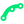
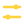
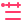
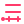
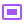
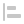
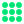
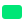

# AE Scripts

Adobe After Effects 用の ExtendScript（JSX）をまとめるモノレポです。

## リポジトリ構成

- `scripts/` — `ファイル > スクリプト` から実行する単発スクリプト
- `panels/` — `ScriptUI Panels` に配置するドッキング可能なパネル
- `extensions/` — HTML/CSSで構築するCEP拡張パネル
- `presets/` — Animation Preset と、その生成用スクリプト
- `tools/` — 共通のビルド、検証、配布ツール
- `templates/` — 新しいスクリプト／パネル用の再利用可能なテンプレート

各ツールは用途別ディレクトリへ配置します。対応するSVGはKBarなどのランチャー用アイコンです。実験中のものは、継続して管理する段階になってからこのリポジトリへ追加します。

`scripts/` 配下は用途別に分類します。

- `shape/` — シェイプの生成、選択、パス、塗りと線
- `text/` — テキストレイヤーの生成と選択
- `transform/` — 反転、スケール、位置などの変形
- `markers/` — マーカーの追加と書き出し
- `masks/` — マスク操作
- `composition/` — コンポジション構造と尺の操作
- `timeline/` — イン点、アウト点などタイムライン編集
- `system/` — キャッシュなどAfter Effects全体の操作
- `project/` — プロジェクトファイルと保存場所の操作
- `property/` — 選択プロパティの制御と変換

KBar用SVGがある場合は、対応するJSXと同じベース名にします（例: `Tool.jsx` / `Tool.svg`）。

## Scripts

### Shape / Text

| ツール | 概要 |
| --- | --- |
|  **Select Shape Layers** | 選択範囲、未選択時はコンポ全体からシェイプレイヤーだけを選択 |
|  **Select Text Layers** | 選択範囲、未選択時はコンポ全体からテキストレイヤーだけを選択 |
|  **Create Shape Style Controller** | 選択したシェイプレイヤーの塗りと線を一括操作するNullを作成 |
|  **Toggle Fill** | 選択したシェイプ／テキストの塗りを切り替え |
|  **Toggle Stroke** | 選択したシェイプ／テキストの線を切り替え |
|  **Swap Fill / Stroke Colors** | シェイプ／テキストの塗りと線を表示状態ごと交換 |
|  **Nulls From Selected Shape Paths** | 選択したシェイプパスからNullを作成 |

### Transform / Property

| ツール | 概要 |
| --- | --- |
|  **Flip Horizontal** | 選択レイヤーを左右反転 |
|  **Flip Vertical** | 選択レイヤーを上下反転 |
|  **Unlink Scale Dimensions** | Scale X／Y／Zスライダーを追加して独立制御 |
|  **Link Scale Dimensions** | スライダーの結果をScaleへベイクしてコントロールを削除 |
|  **Add Slider Control** | 選択した数値プロパティへ現在値・キーフレーム付きのスライダー制御を追加 |

### Timeline / Markers

| ツール | 概要 |
| --- | --- |
|  **Set In Point** | 選択レイヤーのイン点を再生位置へ設定 |
|  **Set Out Point** | 選択レイヤーのアウト点を再生位置へ設定 |
|  **Trim To First Selected** | 選択配列の先頭レイヤーへ他のイン点・アウト点を揃える |
|  **Trim To Last Selected** | 選択配列の末尾レイヤーへ他のイン点・アウト点を揃える |
|  **Add Marker** | 選択レイヤー、未選択時はコンポへマーカーを追加 |
|  **Delete Marker At Playhead** | 再生位置のレイヤー／コンポマーカーを削除 |
| **Export Markers** | コンポジション／レイヤーマーカーを書き出し |

### Composition / Project

| ツール | 概要 |
| --- | --- |
|  **Create Comp Size White Solid** | コンポサイズ・コンポ尺の白平面を作成 |
|  **Duplicate Comp Hierarchy** | 選択中または現在のコンポと子コンポを参照関係ごと複製してフォルダへ格納 |
| **Match Nested Comp Duration** | ネストコンポジションの尺を親または選択レイヤーへ合わせる |
|  **Open Project Parent Folder** | 保存中のプロジェクトフォルダの一つ上をFinder／Explorerで開く |

### Masks / System

| ツール | 概要 |
| --- | --- |
| **Change Mask Mode** | 選択レイヤーのマスクモードを一括変更 |
|  **Purge All Caches** | RAM・ディスク・Undo・Snapshotキャッシュを一括削除 |

## Panels

| パネル | 概要 |
| --- | --- |
|  **Align Layers** | 2D／3Dレイヤーを選択範囲またはコンポ基準で整列・均等配置 |
|  **Alpha To Mask** | オートトレースしたマスクをレイヤーへ分割 |
| **Change Footage Framerate** | フッテージとコンポジションのフレームレートを変更 |
| **Comp Bookmarks** | コンポジションをブックマーク管理 |
| **Dependency Graph** | プロジェクトの依存関係をHTMLグラフとして表示 |
| **Flip Tools** | レイヤーの反転とスケール連携を操作 |
| **Marker Editor** | 選択レイヤーのマーカー色とコメントを編集 |
|  **Purge All Caches** | キャッシュを一括または種類別に削除 |
| **Scale KF Paste** | 相対的な動きを保ってスケールキーフレームをコピー＆ペースト |
| **Shape Fill Stroke** | Illustrator風UIでシェイプの塗りと線を操作 |

## CEP Extensions

| パネル | 概要 |
| --- | --- |
| **Animation Preset Viewer / Save** | FFX・コンポ・プロジェクトを種類別フォルダへ整理し、サムネイル付きで保存・閲覧・適用するHTMLパネル |

## Presets

| プリセット | 概要 |
| --- | --- |
|  **Circle Repeater** | 中央固定または左上起点で、円を四角いグリッド状に反復 |
|  **Trimmed Circle** | Start／End／Offsetでパスのトリミングを操作する正円を生成 |
|  **Simple Text** | 中央へシンプルなテキストレイヤーを生成 |
|  **Simple Rectangle** | Width／Height／Roundness付きの四角形を生成 |

## インストール

- `scripts/` 配下の JSX は After Effects の `Scripts` フォルダへコピーします。
- `panels/` 配下の JSX は After Effects の `Scripts/ScriptUI Panels` フォルダへコピーし、After Effects を再起動します。
